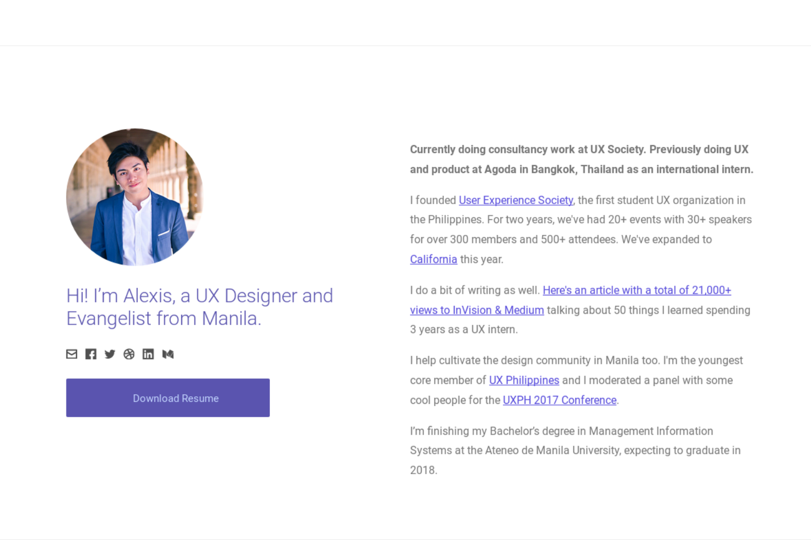

# Lodi Theme

This theme is a Hugo port of [Alexis Collado's portfolio website](http://www.alexiscollado.com). It is meant to be a portfolio theme, with sections for describing yourself, your 
specialties, and some projects.



## Installation

Follow the themes guide on the [Hugo website](https://gohugo.io/themes/installing-and-using-themes/). Briefly, within your Hugo folder:

```sh
$ cd themes
$ git clone https://github.com/xaviablaza/hugo-lodi-theme.git
```

## Getting started

Copy everything within `exampleSite` into the root of your website folder, and edit it to your hearts content!

If you're lazy, you can do this within the `themes` folder:
```sh
$ cp -r hugo-lodi-theme/exampleSite/* ../
```

Add `theme = "hugo-lodi-theme"` to the  `config.toml` in your root folder, or when serving, use `hugo server -t hugo-lodi-theme`

## Adding a new project

At the root of your Hugo site, you can use
```sh
$ hugo new mypost.md
```
to generate a new project post. To find the post, you can go to `content/mypost.md` and you can use that file to write details about your project and the body of your project in markdown.

```yaml
---
# This determines what shows up first, lower weight = shows up first
weight: 1

# This is what appears as the tab's title
title: "Cope | Alexis Collado"

# This is the description in the <head> tag
description: "I set a direction for the branding and identity of the product and crafted a functioning prototype ready for usability testing and development."

# This the heading of the navigation at the top of the project
nav_heading: "Cope Project"

# This is what appears in the projects section, place this image at the /static/img folder
thumbnail: "cope.jpg"

# This is the title of the project in the projects section
project_short_title: "Cope iOS App"

# This is the title of the project in the project page
project_title: "Cope iOS App"

# This is the subtitle of the project in the projects section and the project page
project_subtitle: "Mobile App Design"

# This is the project description in the projects section
project_description: "Cope is a mobile app that allows mental health help seekers track their symptoms and medication. I helped them create a minimum viable product for testing."

# This is the featured image of the project, place this image at /post_title_here/img folder
# e.g. /mypost/img
project_feature_img: "featured-cope.jpg"

# This is the project summary in the project itself
project_summary: "Cope is an application that helps users track their mental health. Progress is measured through the use of a check-in system, calendar, medicine tracker and a summary dashboard. I created a minimum viable product for this application."

# Other people who worked on the project, optional
collaborators:
  - name: "Carlos Arcenas"
    url: "<personal site URL here>"
  - name: "Kat Uytiepo"
    url: "<personal site URL here>"
  - name: "John Palomo"
    url: "<personal site URL here>"

# Technologies used on the project, optional
technologies: ["Sketching", "Mockups", "Guerilla Testing"]

# Links at the bottom of the project and where they link to
# img is the svg that's part of the button. You can use eyeball.svg or download.svg
# Place your custom svgs into /static/svg
button_links:
    - link: "https://marvelapp.com/g4b64e/screen/14364499"
      img: "eyeball.svg"
      text: "View Prototype"
    - link: "http://copenow.co/"
      img: "eyeball.svg"
      text: "View Landing Page"
    - link: "cope.pdf"
      img: "download.svg"
      text: "Download Feature Sets"

# Testimonial text
testimonial: "Alexis designed everything for Cope from the ground up. What I really like about him is his true understanding and grasp of what makes a great UI great. He knows that the user experience needs a lot of refining from customers and he isn't shy to take feedback even if it's critical. Alexis is one of those rare people who just gets it."

# Testimonial photo, place this at /post_title_here/img
# e.g. /mypost/img
testimonial_photo: "john.jpg"

# Author of testimonial
testimonial_author: "John Robert Palomo"

# Testimonial subtitle, usually position of the testimonial author
testimonial_subtitle: "Co-founder, Cope"

date: {{ .Date }}
draft: false

# Write the content of your project below the three dashed lines. You can use markdown and raw HTML.
---

```

## Credits

Credits for this theme goes fully to Alexis Collado, UX design lodi and cofounder of the User Experience Society. More werpa to you.
